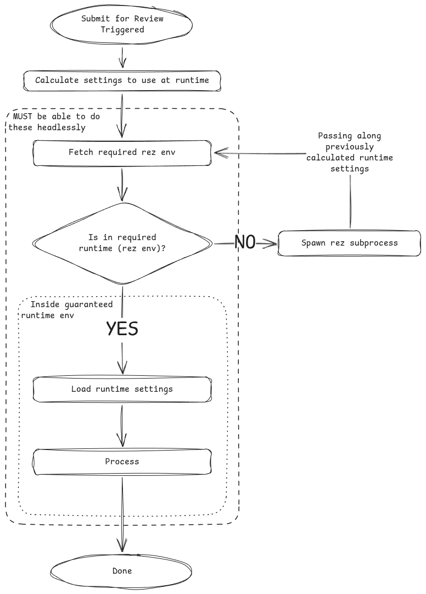

# tk-rez-reviewsubmission

Rez environment based, extensible review submission app

- Extensible settings
- Configurable, guaranteed runtime using [Rez]

## Overview



### Default Config

Unlike [tk-multi-reviewsubmission], which requires it to be run from other apps, this can be run from an engine.

Assuming [tk-rez-reviewsubmission] is setup in `tk-config-default2/env/includes/app_locations.yml` as you would with [tk-multi-reviewsubmission]:

```yaml
# tk-config-default2/env/includes/settings/tk-maya.yml
settings.tk-maya.asset_step:
  apps:
    tk-rez-reviewsubmission.turntable:
      location: "@apps.tk-rez-reviewsubmission"
      ...tbc...
    tk-rez-reviewsubmission.shot-review:
      location: "@apps.tk-rez-reviewsubmission"
      ...tbc...
```

[Rez]: https://rez.readthedocs.io/en/stable/index.html
[tk-multi-reviewsubmission]: https://github.com/shotgunsoftware/tk-multi-reviewsubmission
